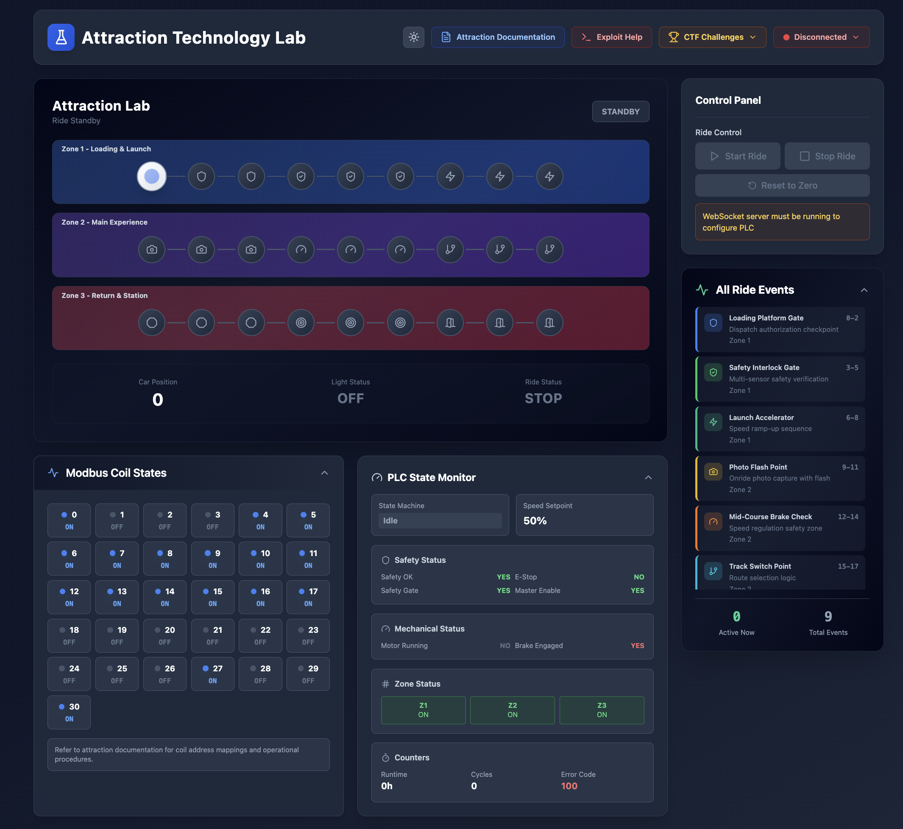

# Attraction Technology Virtual Lab



A comprehensive web-based virtual lab for testing attraction control systems, Modbus/PLC communication, and ICS/SCADA cybersecurity scenarios with **10 CTF challenges**.

## Overview

This project simulates an attraction ride control system with:
- Multi-zone attraction with 5 controllable zones
- Advanced state machine (Idle, Starting, Running, Stopping, Emergency, Maintenance)
- Real-time Modbus TCP communication with OpenPLC
- Safety interlock system (E-stop, safety gate, master enable)
- 10 CTF challenges ranging from easy to hard
- Runtime and cycle counters with maintenance triggers
- Speed control and position tracking

## Architecture

### Web Interface (React + TypeScript)
- **AttractionVisualizer**: Visual representation of the ride with car and lights
- **ControlPanel**: Ride control interface
- **PLCStatus**: WebSocket and PLC connection status
- **PLCStateMonitor**: Real-time PLC state machine and system status
- **CoilStatus**: Live Modbus coil state visualization
- **CTFChallenges**: Real-time challenge tracking with points system
- Connects to WebSocket server for real-time PLC communication

### Standalone Server (Python)
- **standalone_server.py**: All-in-one server serving web interface, WebSocket, and Modbus
- Maintains persistent Modbus TCP connection to PLC
- Handles WebSocket connections from web interface
- Bridges browser ↔ PLC communication
- Logs events to Supabase database

### Database (Supabase PostgreSQL)
- `lab_sessions`: Tracks individual lab sessions with scenario types
- `modbus_events`: Logs all Modbus communication (reads/writes)
- `attraction_states`: Records attraction state snapshots over time
- `security_alerts`: Security event logging and anomaly detection
- `challenges`: CTF challenge definitions with difficulty and points
- `challenge_completions`: Tracks completed challenges per session

### Python Scripts
Located in `/scripts`:
- **standalone_server.py**: Integrated web + WebSocket + Modbus server (started via start.sh)
- **upload_st_to_openplc.py**: Automated PLC program deployment
- **probe.py**: Diagnostic tool for Modbus testing
- **plc_modbus_map.py**: Memory map definitions for Modbus communication

### PLC Program
- **attraction_control.st**: Enhanced Structured Text program with:
  - 6-state machine (Idle, Starting, Running, Stopping, Emergency, Maintenance)
  - 5 controllable zones with position tracking
  - Safety interlock logic (gate, e-stop, master enable)
  - Speed setpoint control (0-100%)
  - Runtime hours and cycle counters
  - Maintenance flag triggers
  - Error code tracking

## CTF Challenges

### Easy Challenges (100-150 points)
1. **Lights Out** - Prevent flash light activation using MitM attack
2. **Emergency Override** - Trigger emergency stop via Modbus

### Medium Challenges (150-250 points)
3. **Stealth Mode** - Keep ride running for 3 laps without flashing
4. **Traffic Analysis** - Intercept and log 10+ Modbus commands
5. **Zone Manipulation** - Disable attraction zones during operation
6. **Runtime Manipulation** - Trigger maintenance flag through counter manipulation

### Hard Challenges (300-400 points)
7. **Speed Control** - Modify ride speed through register manipulation
8. **Safety Bypass** - Start ride with safety gate open
9. **State Machine Attack** - Force PLC into maintenance mode
10. **Full Laps Silent** - Complete 3 laps without any flash light activations

**Total Points Available: 2,350**

See `ATTACK_GUIDE.md` for detailed attack vectors and methods.

## Getting Started

### Prerequisites
- Node.js 18+
- Python 3.8+
- Docker (for OpenPLC)
  - **Windows**: Install [Docker Desktop](https://www.docker.com/products/docker-desktop)
  - **macOS**: Install [Docker Desktop](https://www.docker.com/products/docker-desktop)
  - **Linux**: Install Docker Engine using your package manager

### Installation & Setup

Run the automated installation script for your operating system:

#### Linux / macOS
```bash
bash install.sh
```

#### Windows (Command Prompt or PowerShell)
```cmd
install.bat
```

#### Windows (Git Bash)
```bash
bash install.sh
```

This will:
- Install Node.js dependencies
- Build the web interface
- Create a Python virtual environment
- Install Python dependencies

Environment variables are pre-configured in `.env` - no setup needed!

### Running the Lab

#### Linux / macOS

1. **Activate the Python virtual environment:**
```bash
source venv/bin/activate
```

2. **Start Everything (OpenPLC + WebSocket Server + Web Interface):**
```bash
cd scripts && bash start.sh
```

#### Windows (Command Prompt or PowerShell)

1. **Activate the Python virtual environment:**
```cmd
venv\Scripts\activate
```

2. **Start Everything:**
```cmd
cd scripts
start.bat
```

#### Windows (Git Bash)

1. **Activate the Python virtual environment:**
```bash
source venv/Scripts/activate
```

2. **Start Everything:**
```bash
cd scripts && bash start.sh
```

---

The startup script will:
- Start the OpenPLC container with Docker
- Upload and compile the attraction control program
- Start the PLC runtime
- Launch the integrated web server with WebSocket support

**Open in Browser:**
- Navigate to http://localhost:3000
- The lab will **automatically connect** to the PLC at localhost:502
- The system will auto-initialize with safe baseline conditions
- Click the **Help** button to read the attraction documentation and get started!


**Note:** The settings gear icon in the control panel is still available if you need to connect to a different PLC host/port.

#### Attack Scenarios

Attack scripts are available in `/ext_attacks` with examples for each CTF challenge. These demonstrate various attack vectors:

```bash
# Example: Zone manipulation attack
python ext_attacks/challenge_03_zone_manipulation.py

# Example: Safety bypass attack
python ext_attacks/challenge_04_safety_bypass.py

# Example: State machine attack
python ext_attacks/challenge_06_state_machine.py
```

See `ext_attacks/README.md` for documentation on all available attack scripts.

#### Accessing OpenPLC

The OpenPLC web interface is available at http://localhost:8080

Default credentials: `openplc` / `openplc`

## Features

- **Real-time PLC Simulation** - Advanced state machine with multi-zone control
- **Live Modbus Monitoring** - Watch all coil/register reads and writes
- **CTF Challenge System** - 10 challenges with automatic detection and scoring
- **Automated Setup** - One-command deployment with Docker and Python
- **Complete Logging** - All events stored in Supabase for analysis
- **Beautiful UI** - Production-ready design with real-time updates
- **Safety System Simulation** - E-stop, safety gates, and interlocks
- **Multiple Attack Vectors** - Zone control, state manipulation, counter tampering
- **Educational Attack Scripts** - Pre-built examples for each challenge

## Use Cases

- **ICS/SCADA Security Training** - Learn real-world attack and defense techniques
- **Modbus Protocol Education** - Understand industrial communication protocols
- **Red Team Exercises** - Practice offensive security in safe environment
- **Blue Team Training** - Detect and respond to ICS attacks
- **CTF Competitions** - Built-in scoring and challenge tracking
- **Attraction Control Learning** - Understand theme park ride safety systems

## Technology Stack

- React 18 + TypeScript
- Vite
- Tailwind CSS
- Supabase (PostgreSQL + Realtime)
- Lucide React (icons)
- Python + pymodbus
- OpenPLC Runtime (Docker)

## PLC Memory Map

### Digital I/O (Coils)
- Coil 0: `proximity_sensor` - Position sensor trigger
- Coil 1: `master_enable` - System enable
- Coil 2: `emergency_stop_button` - E-stop status
- Coil 3: `flash_light` - Warning light
- Coil 4: `safety_gate_closed` - Safety gate sensor
- Coils 5-9: `zone_1_enable` through `zone_5_enable` - Zone controls
- Coils 10-11: `start_command`, `stop_command` - Ride controls
- Coils 12-15: System status flags

### Registers (Holding Registers)
- Register 0: `speed_setpoint` (0-100%)
- Register 1: `current_position` (0-359 degrees)
- Register 2-3: `runtime_hours` (DINT)
- Register 4-5: `cycle_counter` (DINT)
- Register 6: `state` (0-5: Idle, Starting, Running, Stopping, Emergency, Maintenance)
- Register 7: `maintenance_flag`
- Register 8: `last_error_code`

See `ATTACK_GUIDE.md` for complete memory map and attack techniques.

## Security Notes

This is a **defensive security training tool** for learning about ICS/SCADA vulnerabilities. All attack scenarios are demonstrated in an isolated environment for educational purposes only.

**Do not** use these techniques on production systems or systems you don't own.

## License

MIT
